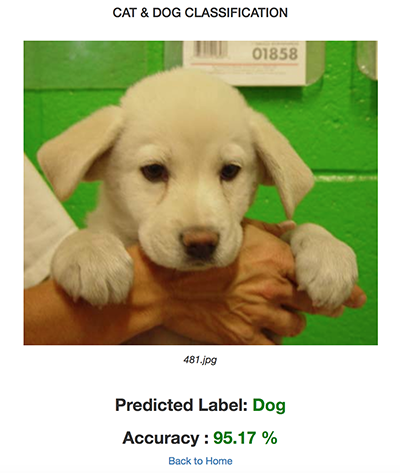

# Dog & Class Classification

# Introduction

This repository provides you source code to train a deep convolutional neuron network on **Kaggle's Dog & Cat** dataset. We're not focus on choosing the best CNN network, we just design a network which gives acceptable accuracy. The trained model is then used by a Flask application which allows user to upload an image of dog or cat and have the model predict the image's label. If you want more details on how the model was trained and the flask app was developed, please visit https://www.mvmanh.com/machine-learning/huan-luyen-mo-hinh-deep-learning-de-phan-loai-anh-va-trien-khai-su-dung-trong-thuc-te.html.

We use Keras, an easy-to-use deep learning framework which builds on top of tensorflow to build and train the model.

# How to use

We got an accuracy of 86% after finishing the training process. If you need a higer accuracy, you could adjust the network achitectures and training parameters. Required dependencies: *tensorflow*, *keras*, *numpy* and *python*. Use this command to start trainning:

    python cat-dog-classification.py

After finishing the training process, put the model (*****_dog-cat-final-model.h5_*****) in *****_static_***** folder of Flask app and run the following commands to start the app:å

    export FLASK_APP=app.py
    python -m flask run

Using any web browser to access:  http://127.0.0.1:5000/
